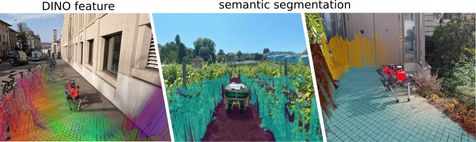

# Elevation Mapping CuPy (ROS2)

- **[Overview](#overview)**
- **[Key Features](#key-features)**
- **[Requirements](#requirements)**
- **[Setup](#setup)**
  - **[Clone the Repo](#1-clone-the-repo)**
  - **[Build the Docker Image](#2-build-the-docker-image)**
  - **[Run the Docker Container](#3-run-the-docker-container)**
  - **[Launch the Elevation Map Node](#4-launch-the-elevation-map-node)**
- **[Elevation Map Input Requirements](#elevation-map-input-requirements)**
  - **[Sensor Setup and Point Cloud Input](#1-sensor-setup-and-point-cloud-input)**
  - **[Framing and TF Tree](#2-framing-and-tf-tree)**
- **[Map Post-Processing: Plane Segmentation and Grid Map Filters](#map-post-processing-plane-segmentation-and-grid-map-filters)**
  - **[Default Filtering Plugins](#default-filtering-plugins)**
  - **[Grid Map Filters](#grid-map-filters)**
  - **[Plane Segmentation](#plane-segmentation)**
- **[Examples](tests/README.md)**
- **[Contributing](#contributing)**
- **[License](#license)**

## Overview

GPU-accelerated elevation mapping for robotic navigation and locomotion. This package provides real-time terrain mapping using CuPy for GPU acceleration, integrating with ROS2 for point cloud registration, ray casting, and multi-modal sensor fusion.




## Key Features

- **Height Drift Compensation**: Tackles state estimation drifts that can create mapping artifacts, ensuring more accurate terrain representation.

- **Visibility Cleanup and Artifact Removal**: Raycasting methods and an exclusion zone feature remove virtual artifacts and correctly interpret overhanging obstacles.

- **Learning-based Traversability Filter**: Assesses terrain traversability using local geometry, improving path planning and navigation.

- **Multi-Modal Elevation Map (MEM) Framework**: Seamless integration of geometry, semantics, and RGB information for multi-modal robotic perception.

- **Semantic Layer Support**: Fuse semantic segmentation data from external sources (point clouds or images) into the elevation map using various fusion algorithms.

- **GPU-Enhanced Efficiency**: Rapid processing of large data structures using CuPy, crucial for real-time applications.

## Requirements

- **OS**: Ubuntu 22.04 LTS (Jammy Jellyfish)
- **ROS 2**: Humble
- **CUDA**: 12.1+
- **Python**: 3.10
- **GPU**: NVIDIA GPU with CUDA support
- **Docker**: 20.10+ with NVIDIA Container Toolkit

## Setup

### 1. Clone the Repo

First, clone the main elevation map repository.
```bash
git clone https://github.com/iit-DLSLab/elevation_mapping_gpu_ros2.git
```
We also need to clone the plane segmentation package, which is included as a submodule in the elevation map repository.
```bash
cd elevation_mapping_gpu_ros2
git checkout develop
git submodule update --init --recursive
```

### 2. Build the Docker Image

First, set the required permissions to execute the shell scripts:
```bash
chmod +x docker/build.sh docker/run.sh
```

Then, run the script to build the Docker image (this may take ~15–20 minutes):
```bash
./docker/build.sh
```

### 3. Run the Docker Container
After building the image, you can instantiate it and start a container by running:
```bash
./docker/run.sh
```

After running the container, you will be inside the Docker environment. A welcome message similar to the following will appear:

```bash
# container startup message ...
ros@dls-Dell-G15-5520:~/ros_ws$
```
Now, you can proceed to launch the elevation map node.


### 4. Launch the Elevation Map Node

```bash
ros2 launch elevation_mapping_cupy elevation_mapping.launch.py use_sim_time:=False
```

If the node is launched successfully, you should see output similar to the following:
```bash
[INFO] [launch]: All log files can be found below /home/ros/.ros/log/2026-03-18-18-30-58-680486-dls-Dell-G15-5520-10113
[INFO] [launch]: Default logging verbosity is set to INFO
[INFO] [elevation_mapping_node.py-1]: process started with pid [10114]
[elevation_mapping_node.py-1] Loaded plugins are  min_filter smooth_filter
[elevation_mapping_node.py-1] [INFO] [1773858661.835987855] [elevation_mapping_node]: Initialized map with length: 8.0, resolution: 0.04, cells: 202
```
The elevation map node has been successfully initialized and is ready to use.

## Elevation Map Input Requirements

The elevation map requires two data sources: **point cloud data** from depth sensors or LiDARs, used to build and maintain the height estimates and **localization data** from odometry algorithms, used to update the map position and propagate uncertainty across cells. 


### 1. Sensor Setup and Point Cloud Input
The elevation map is a 2.5D grid — a top-down map where each cell stores a height value and an associated uncertainty, built and maintained from point cloud data coming from depth cameras or LiDARs. The [aliengo_backpack](https://github.com/iit-DLSLab/aliengo_backpack) repository contains all the sensor drivers supported at DLS Lab (RealSense D435i, Unitree L1 LiDAR, and more) that can be used as point cloud sources for the elevation map.

#### Configuring the Input Source

The input source is configured in [base.yaml](https://github.com/iit-DLSLab/elevation_mapping_gpu_ros2/blob/develop/elevation_mapping_cupy/config/setups/menzi/base.yaml) under the `subscribers` section. There are 3 strategies depending on your setup:

- **Single sensor** — uncomment Option 1 or Option 2 only.
- **Multi-sensor fusion (automatic)** — uncomment both Option 1 and Option 2. 
  - **⚠️ Note:** The auto-merging feature has not been fully benchmarked under real-world conditions with multiple sensor types. Factors such as extrinsic calibration accuracy, time synchronisation offsets, and varying point cloud densities across sensor types may affect map quality. Use with caution in production.
- **Multi-sensor fusion (custom node)** — uncomment Option 3 to use the  [point-cloud fusion package](https://github.com/iit-DLSLab/aliengo_backpack/tree/develop/pointcloud_fusion) which merges multiple point clouds into a single topic before passing it to the elevation map. Currently supports two inputs — contributions to extend this are welcome.

  ```bash
  /elevation_mapping_node:
    ros__parameters:
      subscribers:
      # ── Sensor Input (uncomment ONE section based on your sensor) ─────────────
      
        # Option 1 – Intel RealSense D435i (depth camera)
        # realsense_camera:
        #   topic_name: '/realsense/front/camera/depth/color/points'
        #   data_type: pointcloud

        # Option 2 – Unitree L1 LiDAR
        l1_lidar:
          topic_name: '/unilidar/cloud'
          data_type: pointcloud

        # Option 3 – External point cloud merging package
        # fused_data:
        #   topic_name: '/fused_cloud'
        #   data_type: pointcloud

        # Option 4 – ARCHE GrandTour Dataset (multiple LiDARs)
        # animal_lidar:
        #   topic_name: '/anymal/velodyne/points'
        #   data_type: pointcloud
        # livox_lidar:
        #   topic_name: '/boxi/livox/points'
        #   data_type: pointcloud
        # hesai_lidar:
        #   topic_name: '/boxi/hesai/points'
        #   data_type: pointcloud
  ```


### 2. Framing and TF Tree 
When working with mobile or legged robots, coordinate frames are organized into a tree structure (TF tree). A typical TF tree looks like this:

```bash
  map
   └── odom
          └── base_link
              ├── camera_mount
              │   └── camera_link → camera_optical_frame
              ├── imu_mount
              │   └── imu_link
              └── lidar_mount
                  └── lidar_frame
```

For elevation mapping, two frames must be defined in [core_param.yaml](https://github.com/iit-DLSLab/elevation_mapping_gpu_ros2/blob/develop/elevation_mapping_cupy/config/core/core_param.yaml):

``` bash
map_frame: 'odom'            # The map frame where the odometry source uses.
base_frame: 'base_link'      # The robot's base frame. This frame will be a center of the map.
```

A valid TF chain from map_frame → base_frame is required for the elevation map node to transform incoming point cloud data into the correct frame and build the map correctly. A broken or missing TF chain will cause the map to fail silently or not update at all.

This transformation is typically provided by a SLAM or odometry algorithm such as ORB-SLAM3, DLIO, Point-LIO, or KISS-ICP. The [aliengo_backpack](https://github.com/iit-DLSLab/aliengo_backpack) repository contains all the localization algorithms supported at DLS Lab that can be used as the odometry source for the elevation map.

## Map Post-Processing: Plane Segmentation and Grid Map Filters

The elevation map output is not always perfect out of the box. Map quality depends on sensor characteristics, environment complexity, and the requirements of the target task (e.g. exploration, motion planning, or footstep planning). The package provides three levels of post-processing, from lightweight built-in plugins to full geometric plane segmentation:

1. **Default filtering plugins** — fast, built-in filters enabled directly in the elevation map node
2. **Grid map filters** — flexible custom filter pipeline for advanced terrain analysis
3. **Plane segmentation** — geometric detection of planar regions for high-quality footstep planning

### Default Filtering Plugins

The elevation map package includes a set of built-in post-processing plugins that can be enabled or disabled in [plugin_config.yaml](https://github.com/iit-DLSLab/elevation_mapping_gpu_ros2/blob/develop/elevation_mapping_cupy/config/core/plugin_config.yaml).

Available post-processing plugins:

- `min_filter` / `max_filter` - Morphological operations
- `smooth_filter` - Smoothing filter
- `inpainting` - Fill missing values
- `erosion` - Morphological erosion
- `robot_centric_elevation` - Robot-centric perspective
- `semantic_filter` - Semantic class visualization
- `semantic_traversability` - Semantic-aware traversability
- `features_pca` - PCA feature visualization

Each plugin can be independently toggled in  [plugin_config.yaml](https://github.com/iit-DLSLab/elevation_mapping_gpu_ros2/blob/develop/elevation_mapping_cupy/config/core/plugin_config.yaml).

``` bash
# min_filter fills in minimum value around the invalid cell.
min_filter:                                   
  enable: True                                # weather to load this plugin
  fill_nan: False                             # Fill nans to 
      ...
# Apply smoothing.
smooth_filter:
  enable: True
  fill_nan: False
      ...
# Apply inpainting using opencv
inpainting:
  enable: False
  fill_nan: False
      ...
# Apply smoothing for inpainted layer
erosion:
  enable: False
  fill_nan: False
      ...
```

### Grid Map Filters

For more advanced post-processing, the [grid_map](https://github.com/zhengxiang94/plane_segmentation_ros2/blob/1f129e4866dda22bed983e88547f8d5819e555e6/convex_plane_decomposition_ros/config/node.yaml) package provides a flexible filter pipeline that can be applied on top of the elevation map output. This is the recommended extension point for adding custom filters such as edge detection, smoothing, inpainting, or terrain feature extraction. The [grid_map_demos](https://github.com/ANYbotics/grid_map/tree/humble/grid_map_demos) repository contains a series of example filters that can be used as a starting point.

### Plane Segmentation

For tasks that require precise terrain analysis such as footstep planning or legged robot navigation, plane segmentation goes beyond simple filtering by geometrically detecting and decomposing the planar regions of the map into convex patches. The [plane_segmentation_ros2](https://github.com/zhengxiang94/plane_segmentation_ros2/tree/1f129e4866dda22bed983e88547f8d5819e555e6) package is included as a submodule in this repository and is already compiled inside the Docker image — no additional setup is required.

 To use it, configure the node input in [node.yaml](https://github.com/zhengxiang94/plane_segmentation_ros2/blob/1f129e4866dda22bed983e88547f8d5819e555e6/convex_plane_decomposition_ros/config/node.yaml): 


``` bash
convex_plane_decomposition_ros_node:
  ros__parameters:
    elevation_topic: '/elevation_mapping_node/elevation_map_raw'
    height_layer: 'elevation'
    target_frame_id: 'odom'
    submap:
      width: 3.0
      length: 3.0
    publish_to_controller: true
    frequency: 20.0
```

In this setup, the plane segmentation node receives the raw elevation map output and produces a 3×3 m cropped submap in the `odom` frame. Additional tuning parameters are available in [parameters.yaml](https://github.com/zhengxiang94/plane_segmentation_ros2/blob/1f129e4866dda22bed983e88547f8d5819e555e6/convex_plane_decomposition_ros/config/parameters.yaml).

> 💡 Both `node.yaml` and `parameters.yaml` are mounted from the host at runtime, so they can be edited without rebuilding the Docker image.

## Examples

Step-by-step usage examples (online and offline pipelines) are available in the Examples README:

- [Example 1 – Elevation Mapping with Unitree L1 LiDAR (Online)](tests/README.md#example-1-elevation-mapping-with-unitree-l1-lidar-online)
- [Example 2 – Elevation Mapping with the GrandTour Dataset (Offline)](tests/README.md#example-2-elevation-mapping-with-the-grandtour-dataset-offline)

## Contributing

Contributions are welcome! The semantic fusion infrastructure is available and working - contributions for specific research use cases are appreciated.

## License

MIT License - see [LICENSE](LICENSE) for details.
