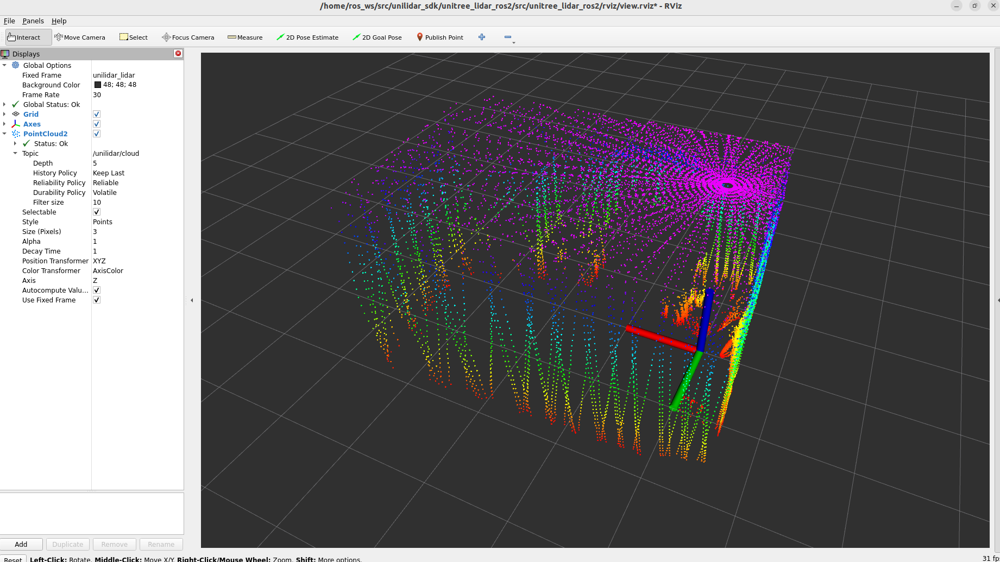
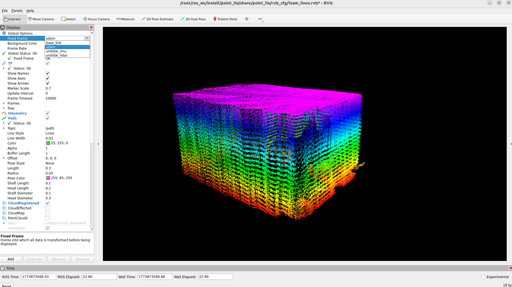
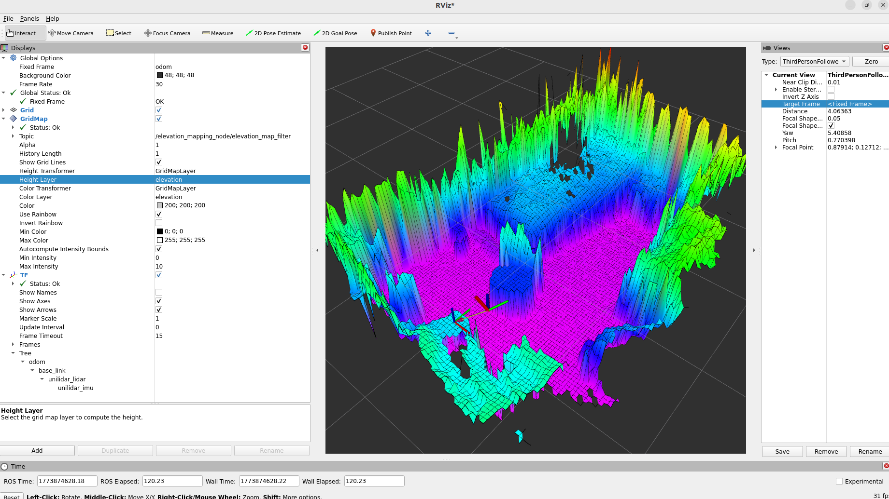
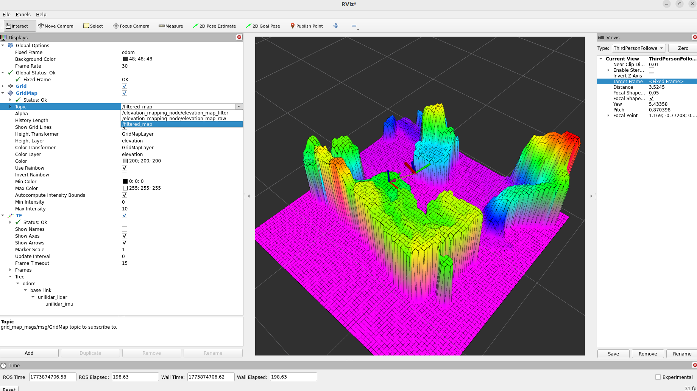
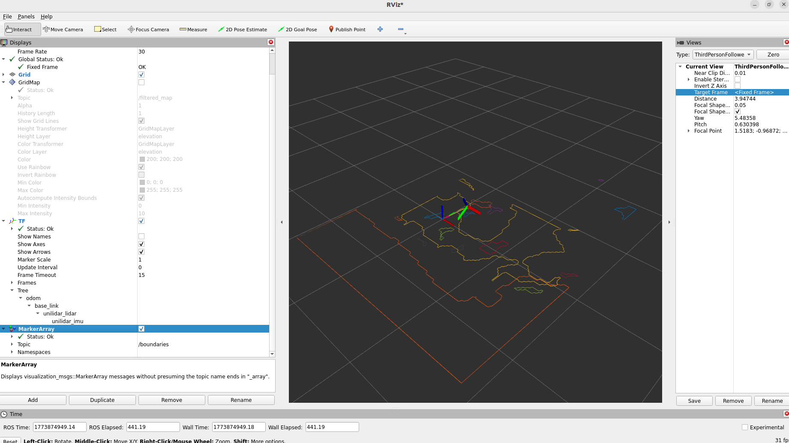
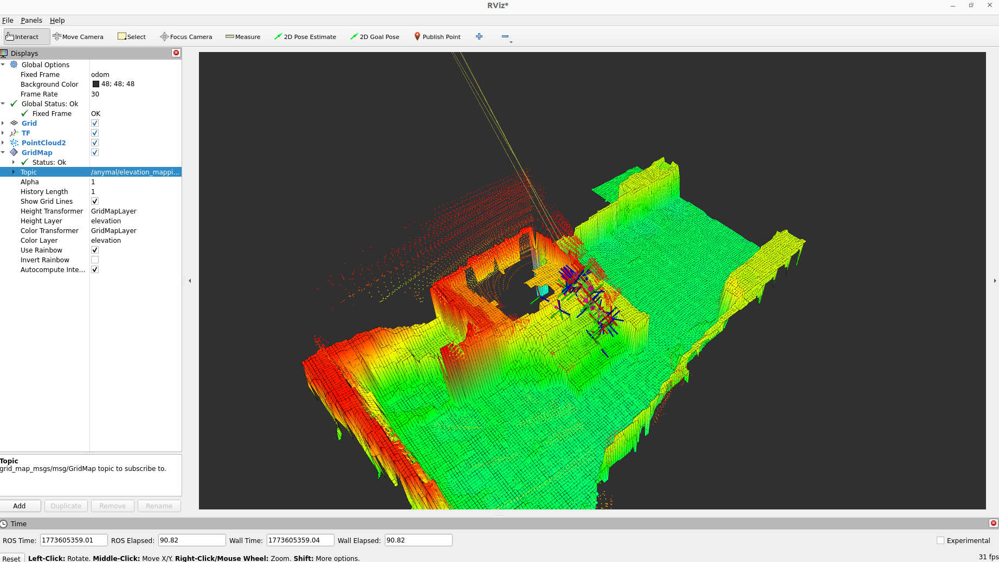
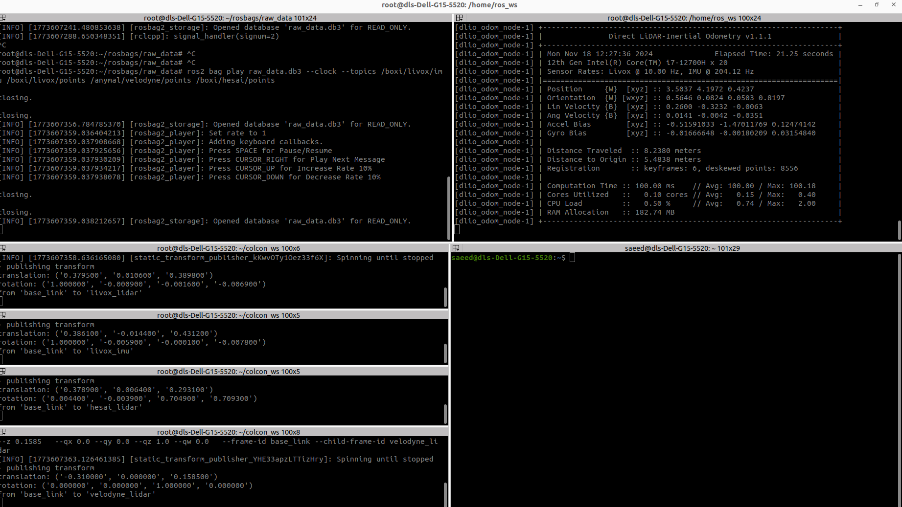
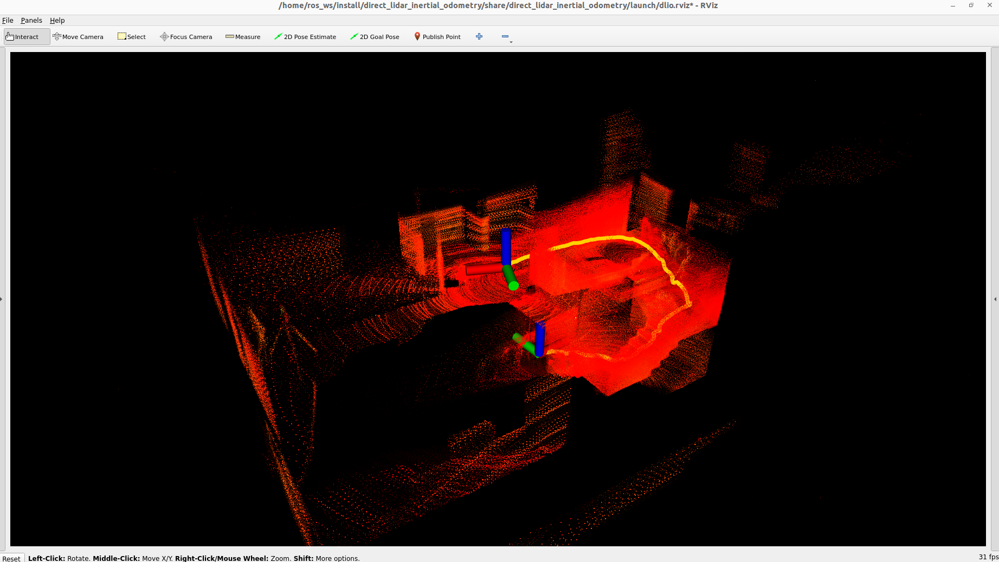
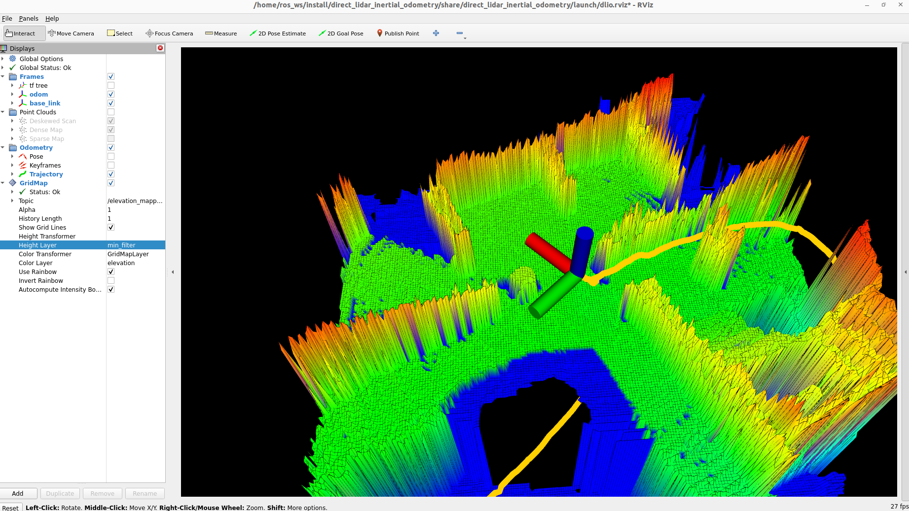
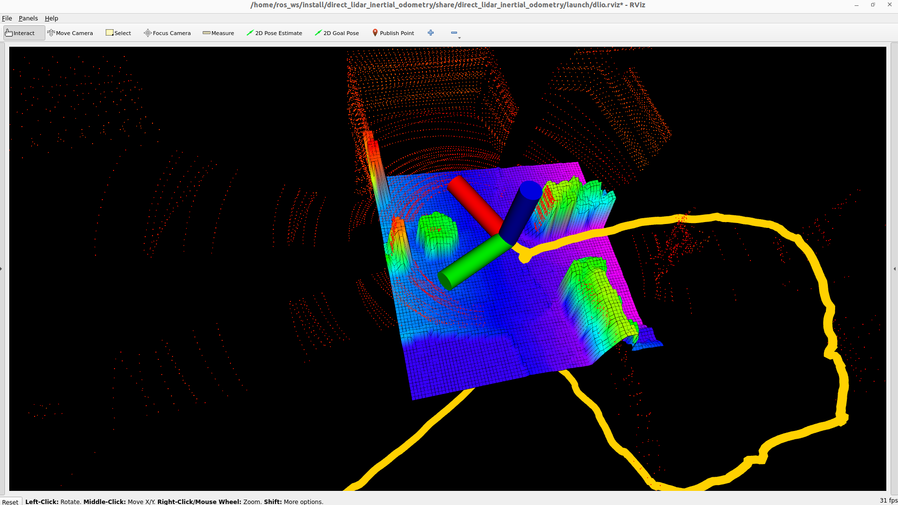

# Elevation Mapping CuPy (ROS2)

This document provides step-by-step examples for running the full elevation mapping pipeline in two scenarios:

- **[Example 1 – Online (Unitree L1 LiDAR)](#example-1-elevation-mapping-with-unitree-l1-lidar-online):** Real-time elevation mapping using a hand-held Unitree L1 LiDAR with Point-LIO for localization. Covers sensor setup, TF configuration, parameter tuning, and plane segmentation post-processing.

- **[Example 2 – Offline (GrandTour Dataset)](#example-2-elevation-mapping-with-the-grandtour-dataset-offline):** Full pipeline replay using a pre-recorded multi-LiDAR dataset (Velodyne, Livox, Hesai) with DLIO localization. No physical hardware required.

Both examples assume the Docker image has been built and the elevation map node is ready to launch. If you haven't done that yet, refer to the [main README](../README.md#setup) for setup instructions.


### Example 1 Elevation Mapping with Unitree L1 LiDAR (Online)

This example walks through the complete pipeline for running the elevation map using:

- **Unitree L1 LiDAR** as the point cloud source
- **Point-LIO** as the localization algorithm
- **Elevation Mapping** for terrain reconstruction
- **Plane Segmentation** for post-processing

#### Step 1 - Sensor Setup

The [aliengo_backpack](https://github.com/iit-DLSLab/aliengo_backpack) repository contains all the sensor drivers supported at DLS Lab. Sensors are launched via [Docker Compose services](https://github.com/iit-DLSLab/aliengo_backpack/blob/master/docker/docker-compose.yaml) . To start the Unitree L1 LiDAR and its RViz visualization, open a terminal and run:

``` bash
docker compose -f docker/docker-compose.yaml up l1 l1_rviz -d
```
The L1 LiDAR has a built-in IMU. The extrinsic calibration between the LiDAR and IMU frames is available from the [official Unitree SDK] (https://github.com/unitreerobotics/unilidar_sdk) and is already published as static transforms inside the `l1_transform` service:

```bash
  l1_transform:
        ...
    command:  bash -c "source /home/ros_ws/install/setup.bash; \
                      ros2 run tf2_ros static_transform_publisher 0.0 0.0 0.0 0.0 0.0 0.0 1.0 base_link unilidar_lidar &
                      ros2 run tf2_ros static_transform_publisher -0.007698 -0.014655 0.00667 0.0 0.0 0.0 1.0 unilidar_lidar unilidar_imu &
                      wait"
```

> 💡 If you are not using the `aliengo_backpack` services, you must publish these two static transforms manually before running the elevation map.

Once the service is running, the LiDAR node starts automatically. You should see the point cloud in RViz:




#### Step 2 - Configure the Elevation Map Inputs

##### Step 2-1 - Point-Cloud Source

The input source is configured in [base.yaml](https://github.com/iit-DLSLab/elevation_mapping_gpu_ros2/blob/develop/elevation_mapping_cupy/config/setups/menzi/base.yaml) under the `subscribers` section. In this example we have a single LiDAR source, so uncomment Option 2 only:

  ```bash
  /elevation_mapping_node:
    ros__parameters:
      subscribers:
      # ── Sensor Input (uncomment ONE section based on your sensor) ─────────────
      
        # Option 1 – Intel RealSense D435i (depth camera)
        # realsense_camera:
        #   topic_name: '/realsense/front/camera/depth/color/points'
        #   data_type: pointcloud

        # Option 2 – Unitree L1 LiDAR
        l1_lidar:
          topic_name: '/unilidar/cloud'
          data_type: pointcloud

        # Option 3 – External point cloud merging package
        # fused_data:
        #   topic_name: '/fused_cloud'
        #   data_type: pointcloud

        # Option 4 – ARCHE GrandTour Dataset (multiple LiDARs)
        # animal_lidar:
        #   topic_name: '/anymal/velodyne/points'
        #   data_type: pointcloud
        # livox_lidar:
        #   topic_name: '/boxi/livox/points'
        #   data_type: pointcloud
        # hesai_lidar:
        #   topic_name: '/boxi/hesai/points'
        #   data_type: pointcloud
  ```

##### Step 2-2 - Framing and TF Tree

In this example we are using a hand-held LiDAR with no robot base, so the TF tree is simplified to:

```bash
   odom
    └── base_link
          ├── imu_mount
            │   └── imu_link
            └── lidar_mount
                  └── lidar_frame
```
The two required frames for the elevation map are set in [core_param.yaml](https://github.com/iit-DLSLab/elevation_mapping_gpu_ros2/blob/develop/elevation_mapping_cupy/config/core/core_param.yaml):

``` bash
map_frame: 'odom'            # The map frame where the odometry source uses.
base_frame: 'base_link'      # The robot's base frame. This frame will be a center of the map.
```

> ⚠️ A valid and continuous TF chain from `map_frame` → `base_frame` is required. A broken or missing TF will cause the map to stop updating silently.

#### Step 3 - Configure the Elevation Map Outputs

The output topics are configured in [base.yaml](https://github.com/iit-DLSLab/elevation_mapping_gpu_ros2/blob/develop/elevation_mapping_cupy/config/setups/menzi/base.yaml)  under the `publishers` section:

- `elevation_map_raw` publishes the unfiltered map directly from the GPU. 
- `elevation_map_filter` publishes the post-processed version with the active plugins applied.

 ```bash
 /elevation_mapping_node:
  ros__parameters:
    subscribers:
    # ── Sensor Input (uncomment ONE section based on your sensor) ─────────────
      # Unitree L1 LiDAR
      l1_lidar:
        topic_name: '/unilidar/cloud'
        data_type: pointcloud

    publishers:
      # ── Map Output Layers ──────────────────────────────────────────────────────
      elevation_map_raw:
        layers: ['elevation', 'traversability', 'variance']
        basic_layers: ['elevation']
        fps: 5.0
      elevation_map_filter:
        layers: ['min_filter', 'smooth', 'inpaint', 'elevation']
        basic_layers: ['min_filter']
        fps: 3.0
  ```

#### Step 4 - Parameter Tuning

The full list of elevation map parameters is in [core_param.yaml](https://github.com/iit-DLSLab/elevation_mapping_gpu_ros2/blob/develop/elevation_mapping_cupy/config/core/core_param.yaml). Map quality depends on sensor characteristics, environment complexity, and task requirements.

> 💡 All parameters in `core_param.yaml` are mounted from the host — changes take effect immediately without rebuilding the image.

#### Step 5 - Post-Processing (Default Plugins)

The built-in filtering plugins are configured in [plugin_config.yaml](https://github.com/iit-DLSLab/elevation_mapping_gpu_ros2/blob/develop/elevation_mapping_cupy/config/core/plugin_config.yaml). For this example the following pipeline is active:


```bash
# min_filter fills in minimum value around the invalid cell.
min_filter:                                   
  enable: True                                # weather to load this plugin
  fill_nan: False                             # Fill nans to invalid cells of elevation layer.
  is_height_layer: True                       # If this is a height layer (such as elevation) or not (such as traversability)
  layer_name: "min_filter"                    # The layer name.
  extra_params:                               # This params are passed to the plugin class on initialization.
    dilation_size: 1                         # The patch size to apply
    iteration_n: 30                           # The number of iterations
# Apply smoothing.
smooth_filter:
  enable: True
  fill_nan: False
  is_height_layer: True
  layer_name: "smooth"
  extra_params:
    input_layer_name: "min_filter"
# Apply inpainting using opencv
inpainting:
  enable: True
  fill_nan: False
  is_height_layer: True
  layer_name: "inpaint"
  extra_params:
    method: "telea"                           # telea or ns
# Apply smoothing for inpainted layer
erosion:
  enable: True
  fill_nan: False
  is_height_layer: False
  layer_name: "erosion"
  extra_params:
    input_layer_name: "traversability"
    dilation_size: 3
    iteration_n: 20
    reverse: True
  ```
> 💡 `plugin_config.yaml` is mounted from the host — plugins can be toggled without rebuilding the image.

#### Step 6 - Run the Localization Algorithm

Before launching the elevation map, a localization algorithm must be running to provide the odom → base_link transform. The [aliengo_backpack](https://github.com/iit-DLSLab/aliengo_backpack) repository contains all supported localization algorithms. In this example, we use the Point-LIO  algorithm.

The Point-LIO [config](https://github.com/iit-DLSLab/aliengo_backpack/blob/master/config/point_lio/unilidar_l1.yaml) for the L1 LiDAR is pre-configured with the correct topic names and IMU-LiDAR extrinsics:

```bash
/**:
    ros__parameters: 
        odom_header_frame_id: "odom"
        odom_child_frame_id: "base_link"
        common:
            lid_topic: "/unilidar/cloud" 
            imu_topic: "/unilidar/imu"
            ...
        preprocess:
            lidar_type: 5
            ...
        mapping:
            imu_en: true
            ...
            # transform from imu to lidar
            extrinsic_T: [ 0.007698, 0.014655, -0.00667] # ulhk # [-0.5, 1.4, 1.5] # utbm
            extrinsic_R: [ 1.0, 0.0, 0.0,
                          0.0, 1.0, 0.0,
                          0.0, 0.0, 1.0 ]  # ulhk 4 utbm 3

        odometry: 
            publish_odometry_without_downsample: true  

        ...
```
To launch Point-LIO, open a new terminal and run:

```bash
docker compose -f docker/docker-compose.yaml up point_lio -d
```

Once running, the complete TF chain is established:

`odom → base_link → unilidar_lidar → unilidar_imu`

You should see the generated map and robot path in RViz with **Fixed Frame** set to `odom`:




#### Step 7 - Launch the Elevation Map

With the sensor and localization running, open a new terminal and launch the elevation map:

```bash
cd elevation_mapping_gpu_ros2
./docker/run.sh
```
Inside the container:

```bash
ros2 launch elevation_mapping_cupy elevation_mapping.launch.py use_sim_time:=False
```

- **Visualization** — open a second shell in the same container:

```bash
# find the container name
docker ps

# attach a new shell
docker exec -it elevation_mapping_container bash

# launch RViz
rviz2
```
You should see the elevation map updating in real time:


#### Step 8 - Post-Processing (Plane Segmentation)

To further improve map quality, run the plane segmentation node in the same container. Open another shell:

```bash
docker exec -it elevation_mapping_container bash
ros2 launch convex_plane_decomposition_ros convex_plane_decomposition.launch.py
```

In the same RViz window, add the following topics to visualize the results:

- **GridMap** → `/filtered_map` — the filtered output of the plane segmentation
- **MarkerArray** → detected planar patches





### Example 2 Elevation Mapping with the GrandTour Dataset (Offline)

This example demonstrates the full elevation mapping pipeline using a pre-recorded dataset with multiple LiDAR sensors, without any physical hardware. It covers dataset preparation, localization with DLIO, multi-LiDAR fusion, and plane segmentation.

- **Sensors used:** Velodyne VLP-16, Livox, Hesai
- **Localization:** DLIO
- **Mode:** Offline (ROS bag playback)

#### Step 1 - Download the Dataset

The **ARCHE – Demolished Scenario** from the [GrandTour dataset]( https://grand-tour.leggedrobotics.com/) was selected as the evaluation environment. It is an indoor scene with mixed flat terrain and stairs — a realistic and challenging test case for the full perception pipeline.

The merged bag file (`raw_data.db3`) is saved on the NAS. Access requires an IIT WiFi connection and valid credentials: [nas signin]( http://nas:5000/#/signin)

- **Bag Files:** The following `.bag` files were downloaded from the GrandTour dataset and converted to ROS2 `.db3` format:

| Bag File | Content |
|---|---|
| `anymal_depth_cameras.bag` | Depth images from 6 ANYmal depth cameras (front, rear, left, right) |
| `anymal_imu.bag` | ANYmal onboard IMU (`/anymal/imu`) |
| `anymal_velodyne.bag` | Velodyne point cloud (`/anymal/velodyne/points`) |
| `anymal_elevation.bag` | Pre-recorded elevation map (`/anymal/elevation_mapping/elevation_map_raw`) |
| `dlio.bag` | Pre-recorded DLIO odometry and undistorted Hesai point cloud |
| `hesai.bag` | Raw Hesai point cloud, range image, and intensity image |
| `livox.bag` | Livox point cloud (`/boxi/livox/points`) |
| `livox_imu.bag` | Livox IMU (`/boxi/livox/imu`) |
| `tf_model.bag` | Static and dynamic TF transforms — sensor extrinsics |
| `hdr_front.bag` | HDR front camera image and camera info |

> ⚠️ tf_model.bag is essential — without it, sensor extrinsics are missing and the pipeline will not initialise correctly.

- **Available Topics:**

| Topic | Type | Rate | Description |
|---|---|---|---|
| `/anymal/imu` | `sensor_msgs/Imu` | ~400 Hz | ANYmal onboard IMU |
| `/anymal/velodyne/points` | `sensor_msgs/PointCloud2` | ~10 Hz | Velodyne VLP-16 point cloud |
| `/boxi/livox/points` | `sensor_msgs/PointCloud2` | ~10 Hz | Livox point cloud |
| `/boxi/livox/imu` | `sensor_msgs/Imu` | ~200 Hz | Livox IMU |
| `/boxi/hesai/points` | `sensor_msgs/PointCloud2` | ~10 Hz | Hesai point cloud |
| `/boxi/dlio/lidar_map_odometry` | `nav_msgs/Odometry` | ~10 Hz | Pre-recorded DLIO odometry |
| `/boxi/dlio/hesai_points_undistorted` | `sensor_msgs/PointCloud2` | ~10 Hz | Motion-undistorted Hesai cloud |
| `/anymal/elevation_mapping/elevation_map_raw` | `grid_map_msgs/GridMap` | ~13 Hz | Pre-recorded elevation map |
| `/anymal/depth_camera/*/depth/image_rect_raw` | `sensor_msgs/Image` | ~15 Hz | Depth images (6 cameras) |
| `/tf` / `/tf_static` | `tf2_msgs/TFMessage` | — | Dynamic and static transforms |

- **Bag Visualization in RViz:**



#### Step 2 — Play the ROS Bag

Only the raw sensor topics are replayed. Pre-recorded odometry and elevation map topics are intentionally excluded so that localization and mapping are computed live:

```bash
ros2 bag play raw_data.db3 \
  --clock \
  --qos-profile-overrides-path qos.yaml \
  --topics \
    /boxi/livox/imu \
    /boxi/livox/points \
    /anymal/velodyne/points \
    /boxi/hesai/points
```

#### Step 3 — Publish Static Transforms

The `tf_model.bag` contains the full robot TF tree, but only the four sensor-to-base transforms are needed here. Publish them manually to keep the setup explicit and minimal:

```bash
# base_link → livox_lidar
ros2 run tf2_ros static_transform_publisher \
  --x 0.3795 --y 0.0106 --z 0.3898 \
  --qx 1.0000 --qy -0.0009 --qz -0.0016 --qw -0.0069 \
  --frame-id base_link --child-frame-id livox_lidar

# base_link → livox_imu
ros2 run tf2_ros static_transform_publisher \
  --x 0.3861 --y -0.0144 --z 0.4312 \
  --qx 1.0000 --qy -0.0059 --qz -0.0001 --qw -0.0078 \
  --frame-id base_link --child-frame-id livox_imu

# base_link → hesai_lidar
ros2 run tf2_ros static_transform_publisher \
  --x 0.3789 --y 0.0064 --z 0.2931 \
  --qx 0.0044 --qy -0.0039 --qz 0.7049 --qw 0.7093 \
  --frame-id base_link --child-frame-id hesai_lidar

# base_link → velodyne_lidar
ros2 run tf2_ros static_transform_publisher \
  --x -0.31 --y 0.0 --z 0.1585 \
  --qx 0.0 --qy 0.0 --qz 1.0 --qw 0.0 \
  --frame-id base_link --child-frame-id velodyne_lidar
```
After publishing, the TF tree is:

```bash
odom
└── base_link
    ├── livox_lidar → livox_imu
    ├── hesai_lidar
    └── velodyne_lidar
```

#### Step 4 — Run DLIO (Localization)

DLIO provides the `odom` → `base_link` transform required by the elevation map. In this example, Livox LiDAR and its built-in IMU are used as the DLIO input.

**Configure [params.yaml](https://github.com/iit-DLSLab/aliengo_backpack/blob/master/config/params.yaml)** — frame and clock settings:

```yaml
ros__parameters:
  use_sim_time: true
  frames/odom: odom
  frames/baselink: base_link
  frames/lidar: livox_lidar
  frames/imu: livox_imu
```

**Configure [dlio.yaml](https://github.com/iit-DLSLab/aliengo_backpack/blob/master/config/dlio.yaml)** — IMU and LiDAR extrinsics extracted from `/tf_static` topics in the bag:

```yaml
extrinsics/baselink2lidar/t: [ 0.3795,  0.0106,  0.3898 ]
extrinsics/baselink2lidar/R: [ 1.0000, -0.0019, -0.0031,
                               -0.0018, -0.9999,  0.0138,
                               -0.0031, -0.0138, -0.9999 ]

extrinsics/baselink2imu/t: [ 0.3861, -0.0144,  0.4312 ]
extrinsics/baselink2imu/R: [ 0.9999, -0.0119, -0.0003,
                             -0.0119, -0.9998,  0.0156,
                             -0.0003, -0.0156, -0.9999 ]
```

**Configure[.dlio](https://github.com/iit-DLSLab/aliengo_backpack/blob/master/config/.dlio)** — set the input topics:

```bash
ROS_DOMAIN_ID=1 
RMW_IMPLEMENTATION=rmw_cyclonedds_cpp
PointCloudTopic=/boxi/livox/points
ImuTopic=/boxi/livox/imu
```

**Launch DLIO:**
```bash
docker compose -f docker/docker-compose.yaml up dlio -d
```
> ⚠️ Wait until DLIO starts publishing /odom before proceeding to the next step.




#### Step 5 — Configure and Launch the Elevation Map

**Update [core_param.yaml](https://github.com/iit-DLSLab/elevation_mapping_gpu_ros2/blob/develop/elevation_mapping_cupy/config/core/core_param.yaml)** to match the DLIO frame names:

```yaml
map_frame: 'odom'            # The map frame where the odometry source uses.
base_frame: 'base_link'      # The robot's base frame. This frame will be a center of the map.
```

**Update [base.yaml](https://github.com/iit-DLSLab/elevation_mapping_gpu_ros2/blob/develop/elevation_mapping_cupy/config/setups/menzi/base.yaml)** — enable all three LiDAR sources using the elevation map's built-in auto-merging feature (Option 4):

```yaml
/elevation_mapping_node:
  ros__parameters:
    subscribers:
    # ── Sensor Input (uncomment ONE section based on your sensor) ─────────────
    
      # Option 1 – Intel RealSense D435i (depth camera)
      # realsense_camera:
      #   topic_name: '/realsense/front/camera/depth/color/points'
      #   data_type: pointcloud

      # Option 2 – Unitree L1 LiDAR
      # l1_lidar:
      #   topic_name: '/unilidar/cloud'
      #   data_type: pointcloud

      # Option 3 – External point cloud merging package
      # fused_data:
      #   topic_name: '/fused_cloud'
      #   data_type: pointcloud

      # Option 4 – ARCHE GrandTour Dataset (multiple LiDARs)
      animal_lidar:
        topic_name: '/anymal/velodyne/points'
        data_type: pointcloud
      livox_lidar:
        topic_name: '/boxi/livox/points'
        data_type: pointcloud
      hesai_lidar:
        topic_name: '/boxi/hesai/points'
        data_type: pointcloud
```

**Launch the elevation map:**

```bash
cd elevation_mapping_gpu_ros2
./docker/run.sh
```
Inside the container:

```bash
ros2 launch elevation_mapping_cupy elevation_mapping.launch.py use_sim_time:=True
```

- **Visualization** — open a second shell in the same container:

```bash
# find the container name
docker ps

# attach a new shell
docker exec -it elevation_mapping_container bash

# launch RViz
rviz2
```
You should see the elevation map updating in real time:


#### Step 6 — Run Plane Segmentation

**Update [node.yaml](https://github.com/zhengxiang94/plane_segmentation_ros2/blob/1f129e4866dda22bed983e88547f8d5819e555e6/convex_plane_decomposition_ros/config/node.yaml)** to subscribe to the elevation map output:

```yaml
convex_plane_decomposition_ros_node:
  ros__parameters:
    elevation_topic: '/elevation_mapping_node/elevation_map_raw'
    height_layer: 'elevation'
    target_frame_id: 'odom'
    submap:
      width: 3.0
      length: 3.0
    publish_to_controller: true
    frequency: 20.0
```

Open another shell in the container and launch:

```bash
docker exec -it elevation_mapping_container bash
ros2 launch convex_plane_decomposition_ros convex_plane_decomposition.launch.py
```

In RViz, add the following to visualize the results:

- **GridMap** → `/filtered_map` — the filtered output of the plane segmentation
- **MarkerArray** → detected planar patches



## Contributing

Contributions are welcome! The semantic fusion infrastructure is available and working - contributions for specific research use cases are appreciated.

## License

MIT License - see [LICENSE](LICENSE) for details.
